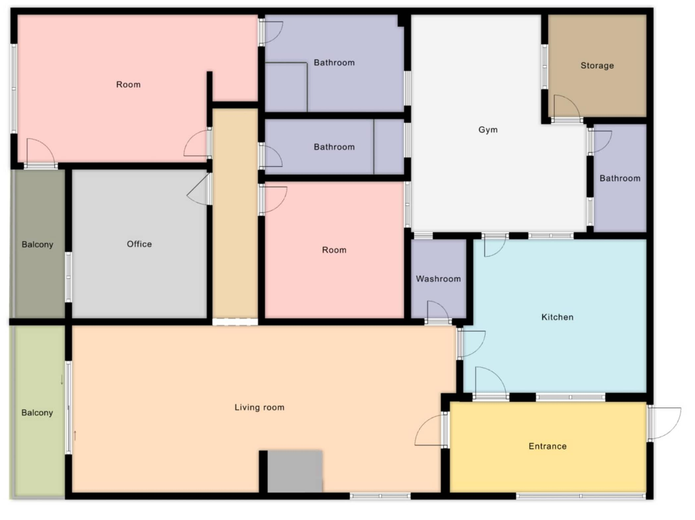
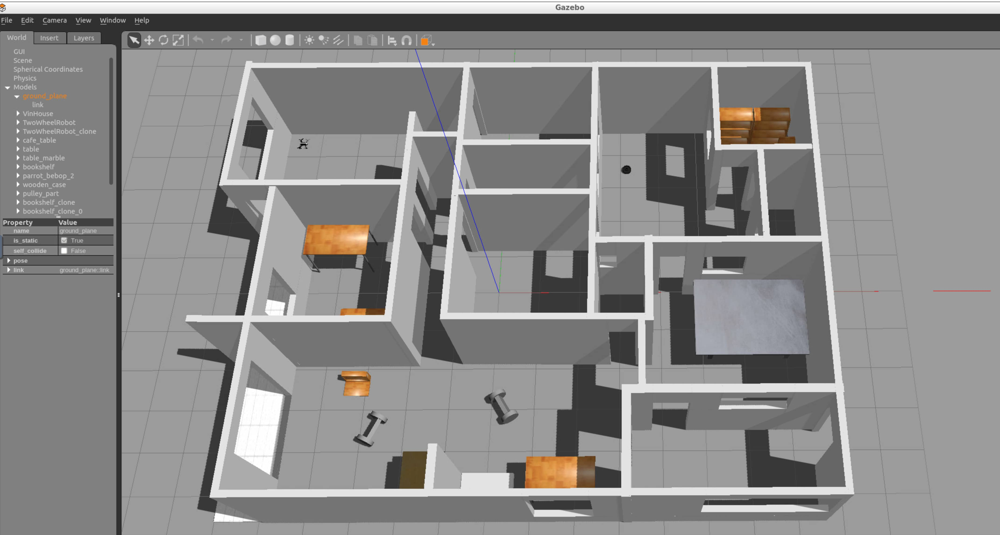

# Build My World

This Gazebo project contains a simulated world to be used in next projects of the Udacity's  [Robotics Software Engineer Nanodegree Program](https://www.udacity.com/course/robotics-software-engineer--nd209).

It contains:
 - A replica of my house created with the **Building Editor** tool in Gazebo using the following floor plan.
 

 - A Two Wheel Robot model with connected joints created with the **Model Editor** tool in Gazebo. 
 - A world with two instances of the robot, my home model, some models from imported from the **Gazebo online library**, and a C++ **World Plugin** that display "Welcome to Vin's World!" message as soon as you launch the Gazebo world file.
 

 ## Prerequisites

- Install the appropriate [CMake](https://cmake.org/install/) for your platform. CMake is a cross-platform open-source software for build automation, testing and packaging using a compiler-independent method.

- Download and install [Gazebo](http://gazebosim.org/), an open-source 3D robotics simulator.

## How to run

1. Clone this repository

    ```sh
    $ git clone https://github.com/computationalcore/build-my-world
    ```

2. Enter in the project folder

    ```sh
    $ cd build-my-world
    ```

3. Enter in build directory and compile the Welcome World plugin.

   ```sh
   $ cd build/
   $ cmake ../
   $ make # You might get errors if your system is not up to date!
   $ cd ../
   $ export GAZEBO_PLUGIN_PATH=${GAZEBO_PLUGIN_PATH}:${PWD}
   ```
   

4. Launch the world file in Gazebo to load both the world and the plugin

   ```sh
   $ gazebo world/VinHome.world
   ```

4. Visualize the output

   * A "Welcome to Vin's World!" message is printed in the terminal. This message interacts with the Gazebo World that includes the two-wheeled robot.

   * The world visualized should be similar to the second screenshot of this README.


## Authors
Vin Busquet

* [https://github.com/computationalcore](https://github.com/computationalcore)

## License

This project is licensed under the MIT License - see the [LICENSE](LICENSE) file for details

## Acknowledgments
* [Robotics Software Engineer](https://www.udacity.com/course/robotics-software-engineer--nd209)
* [Udacity](https://www.udacity.com/)
* [Sebastian Thrun](http://robots.stanford.edu/)
* [Karim Chamaa](https://github.com/karimchamaa)